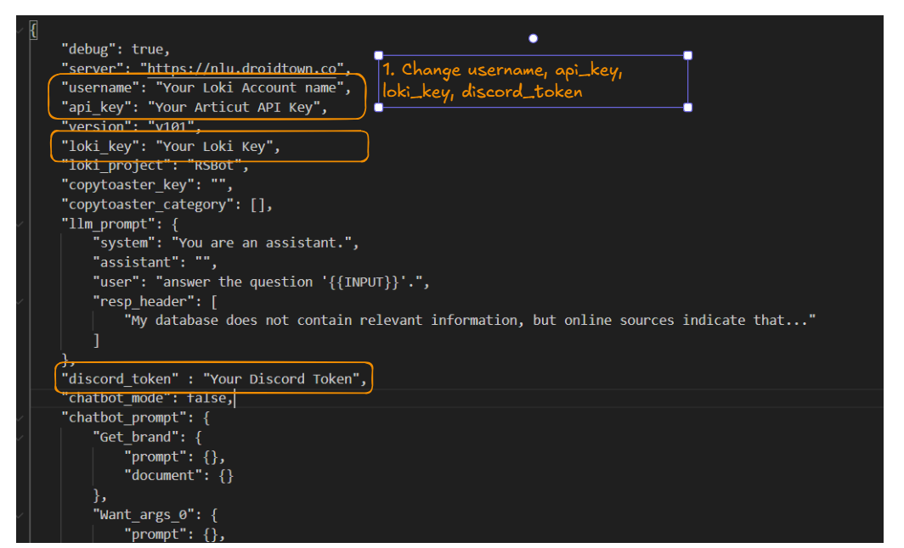
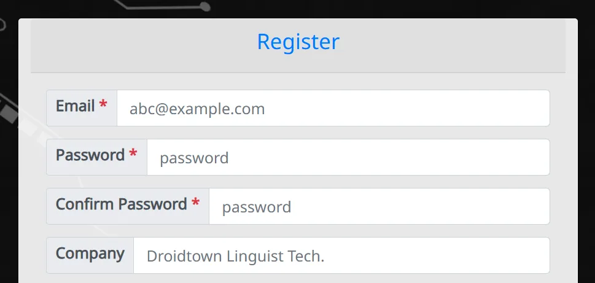

# Readme.md

# E-commerce Recommendation Bot

---

## **Quick Start Guide**

---

E-commerce Recommendation Bot is a bot that assists customers in finding what they need. 

## Environment Setting

---

- Python 3.12.6
- Related module
    
    ```bash
    pip3 install ArticutAPI
    ```
    

## Git Pull Project

---

1. Download the  project
    
    ```bash
    git clone https://github.com/Droidtown/LokiHub.git
    ```
    
2. Change to folder
    
    ```bash
    cd 
    ```
    
3. Open RS_bot/account.info → Change username, api_key, loki_key, discord_token → Save the file
    
    
    

## Droidtown Setting

---

1. Register an account
    
    
    
2. Log into [Loki](https://nlu.droidtown.co/loki/)
    
    
    
3. Create a new project
    
    Insert “Project Name” → Click “Create Project” → Click “RSBot”
    
    
    
4. Import Intent
    
    Click “Import Intent”
    
    
    
    Click “選擇檔案”/”Choose File”
    
    
    
    Select all the ref files (those file are in ref folder) → Click “開啟”/”Open”
    
    
    
    Click “Load Intent” → Click “Deploy All Model”
    
    
    
5. Set LLM
    
    Click “Set LLM”
    
    
    
    Choose the model you want to use → Click the box → Click “Save”
    
    
    
6. Get API_key
    
    Go to “Service Information” ([https://morphagi.droidtown.co/member/](https://morphagi.droidtown.co/member/)) → Click “Copy API Key”
    
    
    
    Paste API Key on RS_bot/accout.info → Save the file
    
    
    
7. Get Loki_key
    
    Go to Loki ([https://morphagi.droidtown.co/loki/](https://morphagi.droidtown.co/loki/)) → Click “Copy” (Make sure the project is RSBot)
    
    
    
    Paste Loki Key on RS_bot/accout.info → Save the file
    
    
    

## Discord Setting

---

1. Go to Discord developers ([https://discord.com/developers/applications/](https://discord.com/developers/applications/)) & Login
    
    
    
2. Click “Application → Click “New Application”
    
    
    
3. Input Bot Name → Click the box → Click “Create”
    
    
    
4. Click “Bot” → Click “Reset Token” (Copy the token)
    
    
    
5. Paste “Token” on RS_bot/account.info
    
    
    
6. Click “Installation” → Copy “Install Link”
    
    
    
7. Paste “Install Link” on your discord server

## Start Your Bot

1. Start your bot
    
    ```bash
    python Discord_bot2.py
    ```
    

## Demo


## Dataset

---

- newlaptops.json was made from part of Amazon Review Dataset 2018

```
Justifying recommendations using distantly-labeled reviews and fined-grained aspects
Jianmo Ni, Jiacheng Li, Julian McAuley
EMNLP, 2019
```

- Some utterances in intents come from VACOS_NLQ Dataset ([https://git.gesis.org/papenmaa/chiir21_naturallanguagequeries/-/tree/master](https://git.gesis.org/papenmaa/chiir21_naturallanguagequeries/-/tree/master))

## Intent Introduction

---


- Want_args_4 and want_args_5 in linguistic are not reasoned. The count of  arguments should less than 3.

## Contact me

---

Name: Anna Liao

Email: ziannaliao@gmail.com