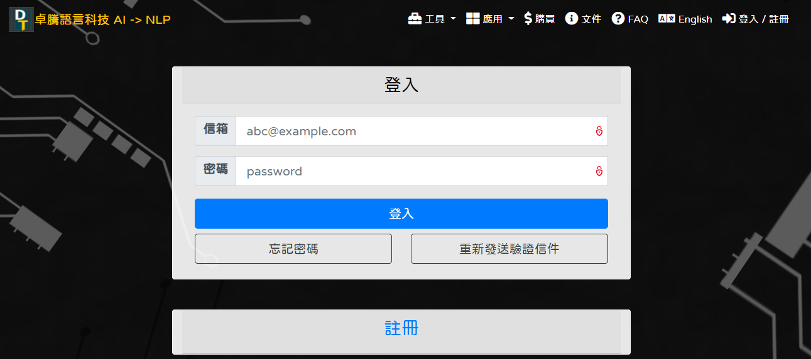
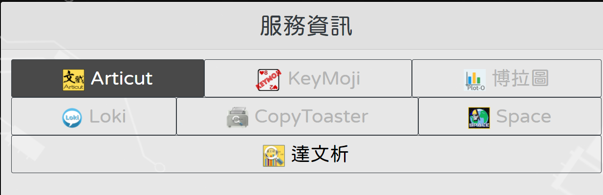

# 這是一個形式語意學小家教

#### 形式語意學是一門利用形式邏輯做為代表語意的工具，用來研究自然語言語意的語言學領域。

#### 學習形式語意學，對很多語言學的同學而言，都會遇到一些困難。

#### 這個專題，實現了一個形式語意學小家教，讓學習者可以發問，得到解答。

---------------------------------------------------------------------------------

### 使用方式

1. 此專案使用Python 3.9 開發，經測試，Python 3.7 以上都可使用
2. 須下載ArticutAPI: pip install ArticutAPI
3. 這個小家教佈署於discord上，故需安裝discord API: pip install discord

--------------------------------------------------------------------

### 示範

使用者：名詞的語意是什麼?

小家教：請問是專有名詞還是普通名詞？

使用者：專名

小家教：指涉叫那個名詞個體，用那個專有名詞來代表其語意

----------------------------------------------------------

### 在Loki上建立形式語意學小家教

- 註冊 [卓騰科技公司](https://api.droidtown.co/login/) 帳號。

- 使用卓騰科技的Loki做句型的解析、學習，並可以從其學習到的句型做衍生，使用者可以使用自己的句子來發問。Loki學習句型，不需要大量語料，只要設計者小心的歸納出發問的可能方式，每種句型只需要一個句子，Loki就可以將句型學習起來。

---------------------------------------------------

#### 聯絡資訊

使用後有什麼問題、建議，歡迎與我連絡：

HunterWu: python.HunterWu@gmail.com