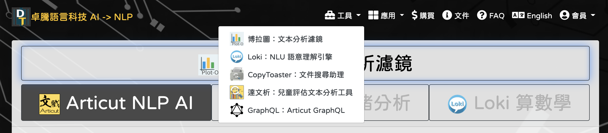
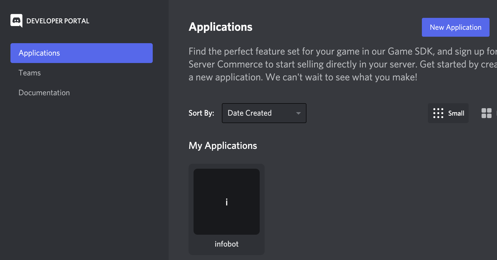

# NBA紀錄對話查詢機器人

提供2017至2020球季單場球賽數據查詢

## 查詢範圍
- 球員單季平均數據
- 球員單季單場最高數據
- 單季球隊個人平均最高數據
- 單季球隊個人單場最高數據

## 查詢範例
- “Russell Westbrook 2020球季平均得分”
- ”2018賽季 Aaron Gordon 單場最高籃板“
- “2020公牛單場抄截最多的球員”

## 資料出處
- reference: https://www.kaggle.com/nathanlauga/nba-games 
- data source: https://www.nba.com/stats/


## 設置環境
` Python 3.7 ` 

## 註冊Loki帳號

1. 至[卓騰語言科技網站](https://api.droidtown.co/)註冊帳號並登入

2. 登入會員之後，點擊「工具」選取Loki：NLU理解引擎



3. 建立Loki專案並匯入ref檔

4. 複製金鑰於 account.info 檔案中


## 註冊Discord帳號

1. 至[Discord](https://discord.com/)註冊帳號並登入

2. 前往[Discord developer](https://discord.com/developers/docs/intro)

3. 點擊「New Application」建立 Discord Bot



4. 複製 discord token 於 account.info 檔案中如下範例

```
{
    "username": "youremail@gmail.com",
    "loki_project_key": "loki_project_key_here",
    "apikey": "driodtown_api_key_here",
    "discord_token": "discord_token_here"
}

```

## 安裝套件
- ArticutAPI
```command
pip install ArticutAPI
```

## 聯繫方式

Albert Kao albertkao227@gmail.com


