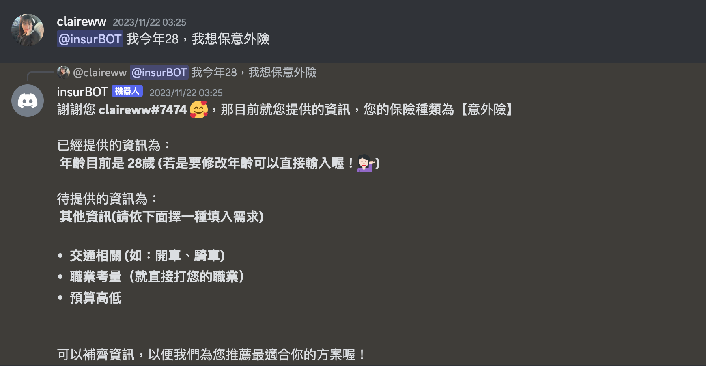

# 網投保險方案推薦機器人
### insurBOT
  insurBOT 是以國泰人壽的網路投保保險方案為依據，進行 __旅平險__、__意外險__、__壽險__ 保險方案推薦。使用者輸入句子(無論是單樣資訊或是多樣資訊)的個人資訊後，經由Loki進行處理，進行語意判斷以及資訊取得，並經過層層篩選後，給出使用者適合他的方案。


## 檔案總覽
```
.
├── insurance_bot.py  # NLU主程式，使用Loki進行處理
├── Discord_insurBot.py  # 處理Discord的運作
├── toFormat.py
├── README.md
├── account.info
├── picture 
│   ├── intro_pic.png
│   ├── how_pic.png
│   └── how_pic2.png
│   
├── insurPD # 篩選已知條件得出保險方案
│   ├── accident.py
│   ├── travel.py
│   └── life.py 
│   
├── answer # 回覆模板
│   ├── reply_general.json
│   ├── reply_insur_accident.json
│   ├── reply_insur_travel.json
│   ├── reply_insur_life.json
│   ├── reply_feature_accident.json
│   ├── reply_feature_travel.json
│   ├── reply_feature_life.json
│   └── reply_no_offer.json
│   
├── intent  # 全部的intent
│   ├── Loki_insur_accident.py
│   ├── Loki_insur_travel.py
│   ├── Loki_insur_life.py
│   ├── Loki_info_days.py
│   ├── Loki_info_traffic.py
│   ├── Loki_info_job.py
│   ├── Loki_info_highBudget.py
│   ├── Loki_info_lowBudget.py
│   ├── Loki_acc_benefit.py
│   ├── Loki_age.py
│   ├── Loki_change_person.py
│   ├── Loki_feature_v2.py
│   ├── Loki_feature.py
│   ├── Loki_life_period.py
│   ├── Loki_no_offer.py
│   ├── Loki_strange.py
│   ├── Loki_switch.py
│   ├── Loki_travel_period.py
│   ├── Loki_way_to_pay.py
│   ├── Loki_way_to_pay2.py
│   ├── USER_DEFINED.json
│   └── Updater.py
│   
└── ref  # 提供Loki讀取
    ├── insur_accident.ref
    ├── insur_travel.ref
    ├── insur_life.ref
    ├── Loki_info_days.ref
    ├── Loki_info_traffic.ref
    ├── Loki_info_job.ref
    ├── Loki_info_highBudget.ref
    ├── Loki_info_lowBudget.ref
    ├── Loki_acc_benefit.ref
    ├── Loki_age.ref
    ├── Loki_change_person.ref
    ├── Loki_feature_v2.ref
    ├── Loki_feature.ref
    ├── Loki_life_period.ref
    ├── Loki_no_offer.ref
    ├── Loki_strange.ref
    ├── Loki_switch.ref
    ├── Loki_travel_period.ref
    ├── Loki_way_to_pay.ref
    └──Loki_way_to_pay2.ref
```

## Demo
- 必須先標註機器人@insurBOT，並輸入「哈囉、嗨」才可以開始使用喔！
- [__Demo Video__](<https://www.youtube.com/watch?v=opll210zje8>): 可點擊進入示範影片
[](https://www.youtube.com/watch?v=opll210zje8)

## 環境設置
+ 套件安裝
  + ```pip3 install ArticutAPI```


# 建立account.info檔案
- ```username``` 為註冊帳號的E-mail
- 可以直接使用 ```account.info``` 檔案

```Python
{
  "discord_token":"",
  "username":"",
  "articut_key":"",
  "loki_key":""
}
```

## 建立Discord Bot
1. 進入[Discord開發者頁面](<https://discord.com/developers/applications/>)
2. 註冊後登入帳號
3. 點選 ```New Application```
4. 輸入Bot的名稱後點選 ```Add Bot```
5. 在 ```TOKEN``` 點選 ```Copy```
6. 填入account.info的 ```discord_toke``` 欄位

## 啟動Loki服務
1. 進入[Droidtown](<https://www.droidtown.co/zh-tw/>)註冊並登入帳號
2. ```服務資訊``` 點選 ```Loki```
3. 點選 ```開始使用Loki```
4. 輸入 ```專案名稱``` 並建立
5. 進入專案後 ```選擇檔案```
6. 選取ref目錄的所有檔案並 ```讀取意圖```
7. 點選左上角的小房子複製 ```專案金鑰```
8. 填入account.info的 ```loki_key``` 欄位

## Articut API
1. 進入[Droidtown](<https://www.droidtown.co/zh-tw/>)登入帳號
2. ```服務資訊``` 點選 ```Articut```
3. 複製 ```API金鑰```
4. 填入account.info的 ```articut_key``` 欄位

## 聯絡資訊
- 若您有其他建議或疑問，歡迎透過E-mail來信，謝謝。
- Claire Wu : <claire.vvu@gmail.com>
- Esther Chung：[a0937123157@gmail.com](mailto:a0937123157@gmail.com)
