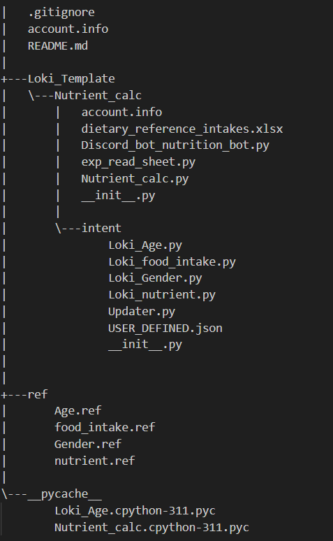

# Nutrient Calculator Chatbot 營養計算小幫手
***
## 簡介
Nutrient Calculator是一款可以根據年齡及性別推薦每日需要營養素(如：鈣、維生素C)的聊天機器人。
***
## 操作指南
請簡單的和機器人打招呼以開始對話，並在每一次說話前先`@Bot`。 
[實際操作影片](https://youtu.be/TabdABk-N-Q)
***
## 檔案總覽

***
## 參考資料 

***
## 聯絡資訊
[Ellen](https://github.com/ellenyp) ivickie621@gmail.com 
[Emily](https://github.com/emilyganpeijie) ganpeijie3@gmail.com

